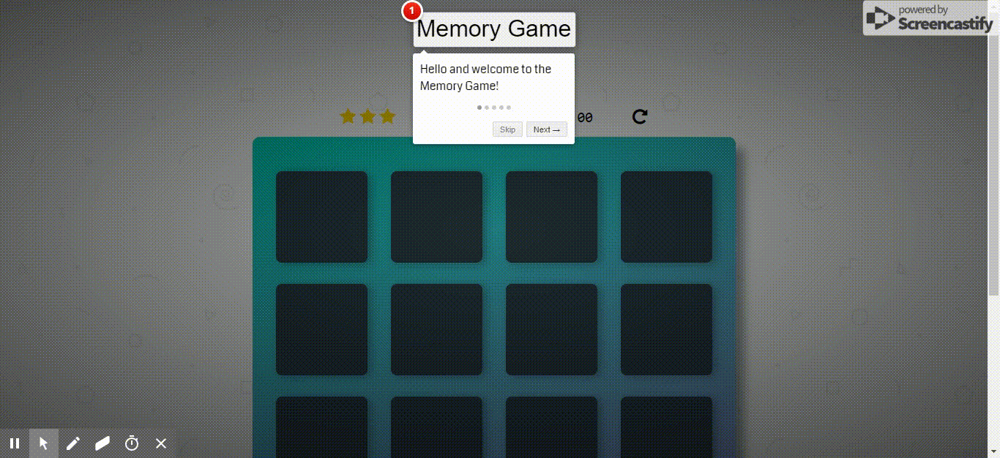

# Memory Game Project

Click the cards to turn them over, remember which cards match, and win in
as few moves as possible! 😃

This project is part of Udacity's Frontend Nanodegree program.

### Live Demo

- [Click here](https://codewithoz.github.io/MemoryGame/)
- Or copy and paste this link into your browser: https://codewithoz.github.io/MemoryGame/

## Table of Contents

- [Instructions](#instructions)
  - [Gameplay](#gameplay)
- [Dependencies](#dependencies)
- [Contributing](#contributing)

## Instructions

The live demo above allows the game to be played without the local files.
You can `git clone` this repo to get the files locally.

### Gameplay

The goal of the game is to match all 16 cards with as few moves and in as little
time as possible. Click/tap a card to reveal its content, then click/tap
another card to see if it matches the revealed card. Unmatched cards will
hide their contents again.

## Dependencies

- [BabelJS' CLI](https://babeljs.io/docs/en/babel-cli) installed **_local_** to the project
- [BabelJS' _env_ preset](https://babeljs.io/docs/en/babel-preset-env) installed **_local_** to the project
- [npx](https://www.npmjs.com/package/npx) installed **_globally_** if it was not installed with your
  version of [npm](https://www.npmjs.com/) (run `npx --version` at the command line to check)

## Contributing

Feel free to submit pull requests for any updates you feel are necessary.
Once the project has been graded by Udacity, I will be happy to review and
accept PRs.

For details, check out [CONTRIBUTING.md](CONTRIBUTING.md).

### Cross-platform testing made possible by [BrowserStack](https://www.browserstack.com)

BrowserStack is _really_ **awesome**. I find it really useful that the mobile
devices run on the same OS versions from when they shipped. I can therefore
see how a page looks with the browser features of the time, as opposed to
checking only viewport characteristics as is often the case with browser
developer tools.
I **strongly** encourage you to give BrowserStack a try. (They are _quite_
generous with open source projects :wink:.)
